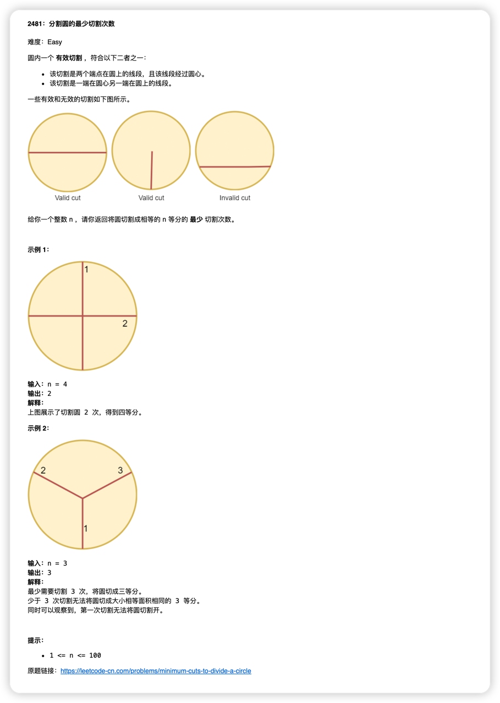

English | [简体中文](./README_ZH.md)
# leetcode-daily-mailer
A simple node program that automatically sends you the `leetcode` daily question every day, using [leetcode-daily-question](https://github.com/ruleeeer/leetcode-daily-question) to get the daily question, and [ nodemailer](https://www.npmjs.com/package/nodemailer) to send emails, the result is as follows

## Quick start
1. The current service is deployed on `vercel` (no payment required)
   You can deploy your own service directly by clicking on the button [](https://vercel.com/new/clone?repository-url=https://github.com/ruleeeer/leetcode-daily-mailer&env=FROM_EMAIL&env=TO_EMAIL&env=SMTP_EMAIL_HOST&env=SMTP_PORT&env=AUTH_USER&env=AUTH_PASS&project-name=leetcode-daily-mailer&repository-name=leetcode-daily-mailer)
2. Set the required environment variables
   | env_name | desc | example | require | default |
   | ----------------|--------------------------|---------------------------------------|---------|---------|
   | FROM_EMAIL | email to send daily questions | send@mail.com | true |
   | TO_EMAIL | The email address to receive the daily question (multiple, separated by commas) | receiver1@mail.com,receiver2@mail.com | true |
   | SMTP_EMAIL_HOST| SMTP domain name of the sender's mailbox | smtp.gmail.com | true |
   | SMTP_PORT| SMTP port of the sender's mailbox | 465 | false | 465 |
   | AUTH_USER| The account number of the sender's mailbox | send@mail.com | true |
   | AUTH_PASS|Password of the sender's mailbox | password | true |
3. in the `. /vercel.json` file to set the sending time, note that `vercel` uses the UTC time zone, the following indicates that it will be sent at 1:00 a.m. every day in the UTC time zone, corresponding to 9:00 a.m. in the UTC+8 time zone
```json
{
   "crons": [
      {
         "path": "/api/send",
         "schedule": "0 1 * * *"
      }
   ]
}
```
4. After deployment, you can directly access the `/api/send` path to test whether the send is successful
## How to debug
1. clone project
2. Set the environment variables locally, create an `.env' file in the project root directory, and set the necessary environment variables in the `.env' file
3. Install `vercel cli` tool according to https://vercel.com/docs/cli
4. Start the project with 'vercel dev
5. Visit `https://localhost:3000/api/send`