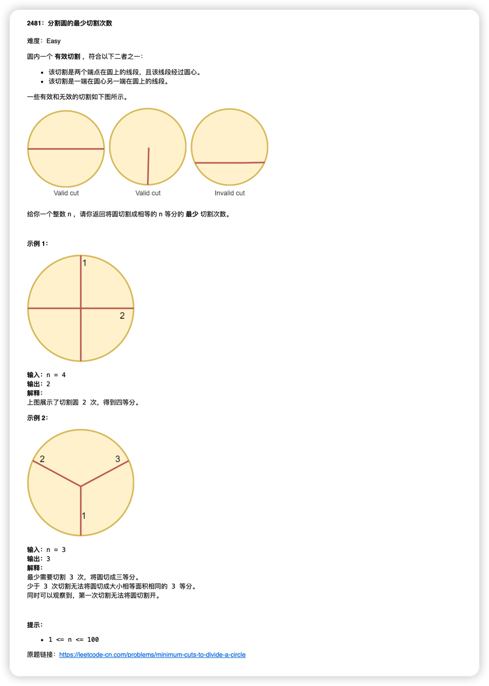

简体中文 | [English](./README.md)
# leetcode-daily-mailer
一个简单的node程序,每天可以自动向你发送`leetcode`每日一题,使用[leetcode-daily-question](https://github.com/ruleeeer/leetcode-daily-question)获取每日一题,使用[nodemailer](https://www.npmjs.com/package/nodemailer)发送邮件,效果如下


## 快速开始
1. 当前服务部署在`vercel`(无需付费)
   ,你可以直接点击按扭部署自己的服务[](https://vercel.com/new/clone?repository-url=https://github.com/ruleeeer/leetcode-daily-mailer&env=FROM_EMAIL&env=TO_EMAIL&env=SMTP_EMAIL_HOST&env=SMTP_PORT&env=AUTH_USER&env=AUTH_USER&project-name=leetcode-daily-mailer&repository-name=leetcode-daily-mailer)
2. 设置必须的环境变量

   | env_name       | desc                     | example                               | require | default |
   |----------------|--------------------------|---------------------------------------|---------|---------|
   | FROM_EMAIL     | 发送每日一题的邮箱                | send@mail.com                         | true    |         |
   | TO_EMAIL       | 接收每日一题的邮箱(支持多个,使用英文逗号分隔) | receiver1@mail.com,receiver2@mail.com | true    |         |
   | SMTP_EMAIL_HOST| 发送方所在邮箱的SMTP域名           | smtp.gmail.com                        | true    |         |
   | SMTP_PORT| 发送方所在邮箱的SMTP端口           | 465                                   | false   | 465     |
   | AUTH_USER| 发送方所在邮箱的帐号               | send@mail.com                         | true    | |
   | AUTH_PASS| 发送方所在邮箱的密码               | password                              | true    | |
3. 在`./vercel.json`文件下设置发送时间,注意`vercel`使用的是UTC时区,下面表示UTC时区每天1点发送,对应UTC+8时区的早上9点
```json
{
  "crons": [
    {
      "path": "/api/send",
      "schedule": "0 1 * * *"
    }
  ]
}
```

4. 部署完成后,可以直接访问`/api/send`路径来测试是否发送成功

## 如何调试
1. clone项目
2. 在本地设置环境变量,在项目根目录创建`.env`文件,在`.env`文件中设置必要的环境变量
3. 根据 https://vercel.com/docs/cli 安装`vercel cli`工具
4. 使用`vercel dev`启动项目
5. 访问`https://localhost:3000/api/send`


